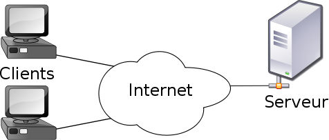
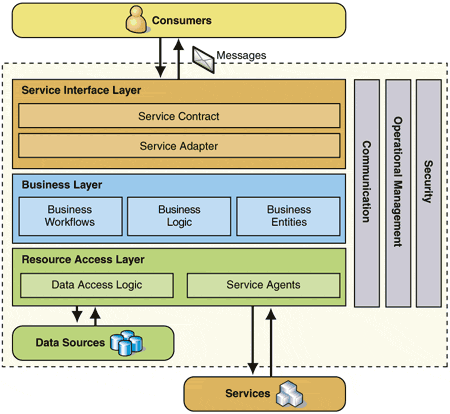

# La conception d'un logiciel

L'objectif de ce chapitre est de décrire le processus de conception d'un logiciel.

## La phase de conception

### Rôle

Tout logiciel, au-delà d'un niveau minimal de complexité, est un édifice qui mérite une phase de réflexion préalable à sa réalisation (codage). On parle de phase de **conception**. Au cours de cette phase, on effectue les grands choix structurant le futur logiciel : langages, technologies, outils... La conception consiste notamment à identifier les différents éléments qui vont composer le logiciel et à organiser les interactions entre ces éléments : autrement dit, à définir son **architecture** (voir plus loin).

Selon le niveau de complexité du logiciel, sa conception peut être une simple formalité ou bien un travail de longue haleine. 

L'activité de conception peut donner lieu à la production de  **diagrammes** représentant les éléments et leurs interactions selon différents formalismes, par exemple UML.

### Nécessité

On n'imagine pas se lancer dans la construction d'un bâtiment sans avoir prévu son apparence, étudié ses fondations et son équilibre, choisi les matériaux utilisés, etc. Dans le cas contraire, on va au-devant de graves désillusions...

Cette problématique se retrouve dans le domaine informatique. Comme un bâtiment, un logiciel est fait pour durer dans le temps. Il est presque systématique que des projets informatiques aient une durée de vie de plusieurs années. Plus encore qu'un bâtiment, un logiciel va, tout au long de son cycle de vie, connaître de nombreuses modifications qui aboutiront à la livraison de nouvelles versions, majeures ou mineures. Les évolutions par rapport au produit initialement créé sont souvent nombreuses et très difficiles à prévoir au début du projet.

Par exemple, le logiciel [VLC](http://www.videolan.org/vlc/) n'était à l'origine qu'un projet étudiant destiné à diffuser des vidéos sur le campus de l'Ecole Centrale de Paris. Sa première version remonte à l'année 2001.

### Place dans le processus de création

La phase de conception intervient traditionnellement vers le début d'un projet logiciel, au moment où les besoins auxquels le logiciel doit répondre sont suffisamment identifiés et avant la phase de production (codage) proprement dite.

Les évolutions d'un projet logiciel peuvent nécessiter de nouvelles phases de conception tout au long de sa vie. C'est notamment le cas avec certaines méthodologies de développement itératif, où des phases de conception souvent brèves peuvent alterner avec des phases de production et de test.

## L'importance des composants logiciels

Un bâtiment s'édifie à partir de morceaux de bases, par exemple des briques ou des moellons. De la même manière, une carte mère est conçue par assemblage de composants électroniques.

Longtemps, l'informatique a gardé un côté artisanal : chaque programmeur recréait la roue dans son coin pour les besoins de son projet. Mais nous aommes passés depuis plusieurs années à une ère industrielle. Des logiciels de plus en plus complexes doivent être réalisés dans des délais de plus en plus courts, tout en maintenant le meilleur niveau de qualité possible. Une réponse à ces exigences contradictoires passe par la réutilisation de briques logicielles de base appelées librairies, modules ou plus généralement **composants**. 

En particulier, la mise à disposition de milliers de projets *open source* via des plates-formes comme [GitHub](https://github.com) ou des outils comme [NuGet](https://www.nuget.org/), [composer](https://getcomposer.org/) ou [npm](https://www.npmjs.com/) a permis aux équipes de développement de faire des gains de productivité remarquables. A l'heure actuelle, il n'est pas de logiciel de taille significative qui n'intègre plusieurs dizaines, voire des centaines de composants externes.

Déjà testé et éprouvé, un composant logiciel fait simultanément baisser le temps et augmenter la qualité du développement. Il permet de limiter les efforts nécessaires pour traiter les problématiques *techniques* afin de se concentrer sur les problématiques *métier*.

Voici parmi bien d'autres quelques exemples de problématiques techniques adressables par des composants logiciels :

* Accès à une base de données (connexion, exécution de requêtes).
* Calculs scientifiques.
* Gestion de l'affichage (moteur 3D).
* Journalisation des évènements dans des fichiers.
* ...

## L'architecture d'un logiciel

### Définition

La mise au point de l'architecture du logiciel est l'un des principaux objectifs de la phase de conception.

L'architecture d'un logiciel décrit les principaux éléments qui composent le logiciel, ainsi que les flux d'échanges entre ces éléments. Elle permet à l'équipe de développement d'avoir une vue d'ensemble de l'organisation du logiciel, et constitue donc en elle-même une forme de documentation.

On peut décrire l'architecture d'un logiciel selon différents points de vue. Entre autres, une vue **logique** mettre l'accent sur le rôle et les responsabilités de chaque partie du logiciel. Une vue **physique** présentera les processus, les machines et les liens réseau nécessaires.

### Exemples d'architectures

Au fil du temps, plusieurs styles d'architecture se sont dégagés. En voici quelques exemples.

#### Architecture client/serveur

L'architecture client/serveur caractérise un système basé sur des échanges réeeau entre des clients et un serveur centralisé.

#### Architecture en couches

Une architecture en couches organise un logiciel sous forme de couches (*layers*). Chaque couche ne peut communiquer qu'avec les couches adjacentes, ce qui simplifie la compréhension des échanges au sein de l'application.

#### Architecture orientée services

Une architecture orientée services (SOA, *Service-Oriented Architecture*) décompose un logiciel sous la forme d'un ensemble de services métier utilisant un format d'échange commun, généralement XML ou JSON. 

Une variante récente, l'architecture microservices, diminue la granularité des services pour leur assurer souplesse et capacité à évoluer, au prix d'une plus grande distribution du système.

