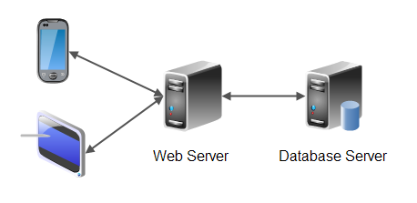
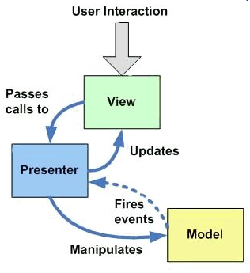

# Patrons logiciels

Ce chapitre présente les patrons logiciels (*software patterns*), qui sont des modèles de solutions à des problématiques fréquentes d'architecture ou de conception.

## Patrons d'architecture

Il n'existe pas une architecture logicielle parfaite qui s'adapterait à toutes les exigences.

Au fil du temps et des projets, plusieurs architectures-types se sont dégagées. Elles constituent des patrons d'architecture (*architecture patterns*) qui ont fait leurs preuves et peuvent servir d'inspiration pour un nouveau projet.

> Vous trouverez une description détaillée des principaux styles architecturaux à [cette adresse](https://msdn.microsoft.com/en-us/library/ee658117.aspx).

#### Architecture client/serveur

L'architecture client/serveur caractérise un système basé sur des échanges réeeau entre des clients et un serveur centralisé, lieu de stockage des données de l'application.

Le principal avantage de l'architecture client/serveur tient à la centralisation des données. Stockées à un seul endroit, elles sont plus faciles à sauvegarder et à sécuriser. Le serveur qui les héberge peut être dimensionné pour pouvoir héberger le volume de données nécessaire et répondre aux sollicitations de nombreux clients. Cette médaille a son revers : le serveur constitue le noeud central du système et représente son maillon faible. En cas de défaillance (surcharge, indisponibilité, problème réseau), les clients ne peuvent plus fonctionner.

On peut classer les clients d'une architecture client/serveur en plusieurs types :

* **Client léger**, destiné uniquement à l'affichage (exemple : navigateur web).
* **Client lourd**, application native spécialement conçue pour communiquer avec le serveur (exemple : application mobile).
* **Client riche** combinant les avantages des clients légers et lourds (exemple : navigateur web utilisant des technologies évoluées pour offrir une expérience utilisateur proche de celle d'une application native).

Le fonctionnement en mode client/serveur est très souvent utilisé en informatique. Un réseau Windows organisé en domaine, la consultation d'une page hébergée par un serveur Web ou le téléchargement d'une application mobile depuis un magasin central (App Store, Google Play) en constituent des exemples.

#### Architecture en couches

Une architecture en couches organise un logiciel sous forme de couches (*layers*). Chaque couche ne peut communiquer qu'avec les couches adjacentes.

Cette architecture respecte le principe de séparation des responsabiltés et facilite la compréhension des échanges au sein de l'application.

Lorsque chaque couche correspond à un processus distinct sur une machine, on parle d'architecture **n-tiers**, `n` désignant le nombre de couches.

Un navigateur web accédant à des pages dynamiques intégrant des informations stockées dans une base de données constitue un exemple classique d'architecture 3-tiers.

#### Architecture orientée services

Une architecture orientée services (SOA, *Service-Oriented Architecture*) décompose un logiciel sous la forme d'un ensemble de services métier utilisant un format d'échange commun, généralement XML ou JSON. 

Une variante récente, l'architecture microservices, diminue la granularité des services pour leur assurer souplesse et capacité à évoluer, au prix d'une plus grande distribution du système. L'image ci-dessous ([source](http://blog.octo.com/larchitecture-microservices-sans-la-hype-quest-ce-que-cest-a-quoi-ca-sert-est-ce-quil-men-faut/)) illustre la défférence entre ces deux approches.

### Architecture Modèle-Vue-Contrôleur

La patron Modèle-Vue-Contrôleur, ou **MVC**, décompose une application en trois sous-parties :

* La partie **Modèle** qui regroupe la logique métier ("business logic") ainsi que l'accès aux données. Il peut s'agir d'un ensemble de fonctions (Modèle procédural) ou de classes (Modèle orienté objet). ;
* La partie **Vue** qui s'occupe des interactions avec l'utilisateur : présentation, saisie et validation des données ;
* La partie **Contrôleur** qui gère la dynamique de l'application. Elle fait le lien entre les deux autres parties.

Ce patron a été imaginé à la fin des années 1970 pour le langage Smalltalk afin de bien séparer le code de l'interface graphique de la logique applicative. On le retrouve dans de très nombreux langages : bibliothèques Swing et Model 2 (JSP) de Java, frameworks PHP, ASP.NET MVC, etc.

Le diagramme ci-dessous (extrait de la documentation du framework PHP [Symfony](https://symfony.com/)) résume les relations entre les composants d'une architecture web MVC.

> Attention à ne pas employer le terme de "couche" à propos d'une architecture MVC. Dans une architecture en couches, chaque couche ne peut communiquer qu'avec les couches adjacentes. Les parties Modèle, Vue et Contrôleur ne sont donc pas des couches au vrai sens du mot.

### Architecture Modèle-Vue-Présentation

La patron Modèle-Vue-Présentation, ou **MVP**, est un proche cousin du patron MVC surtout utilisé pour construire des interfaces utilisateurs (UI). 

Dans une architecture MVP, la partie **Vue** reçoit les évènements provenant de l'utilisateur et délègue leur gestion à la partie **Présentation**. Celle-ci utilise les services de la partie **Modèle** puis met à jour la **Vue**.

Dans la variante dite *Passive View* de cette architecture, la Vue est passive et dépend totalement du contrôleur pour ses mises à jour. Dans la variante dite *Supervising Controller*, Vuet et Modèle sont couplées et les modifications du Modèle déclenchent la mise à jour de la Vue.

## Patrons de conception

Un **patron de conception** (*[design pattern](https://en.wikipedia.org/wiki/Software_design_pattern)*) est une solution standard à un problème de conception. L'ensemble des patrons de conception constitue un catalogue de bonnes pratiques issu de l'expérience de la communauté. Leurs noms forment un vocabulaire commun qui permet d'identifier immédiatement la solution associée. 

> On rencontre également le terme de "motif de conception".

Les patrons de conception ont été popularisés par le livre *Design Patterns – Elements of Reusable Object-Oriented Software* sorti en 1995 et co-écrit par quatre auteurs (le *Gang Of Four*, ou GoF). Ce livre décrit 23 patrons, auxquels d'autres se sont rajoutés depuis.

Chaque patron décrit un problème à résoudre puis les éléments de sa solution, ainsi que leurs relations. La formalisme graphique utilisé est souvent un diagramme de classes UML.

L'exemple ci-dessous décrit le patron de conception **Proxy**, dont l'objectif est de substituer un objet à un autre afin de contrôler l'utilisation de ce dernier.

Il existe également un catalogue d'**anti-patterns**. Comme son nom l'indique, un [anti-pattern](https://en.wikipedia.org/wiki/Anti-pattern) est un exemple de mauvaise pratique à ne surtout pas suivre.

> Certains patterns originaux du GoF sont maintenant plutôt considérés comme des anti-patterns. C'est par exemple le cas du pattern **Singleton** ([explications](https://www.michaelsafyan.com/tech/design/patterns/singleton)).