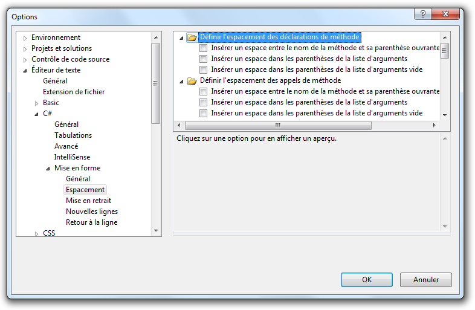

# Production du code source

L'objectif de ce chapitre est de présenter les enjeux et les solutions liés à la production du code source d'un logiciel.

## Introduction

Le code source est le coeur d'un projet logiciel. Il est essentiel que tous les membres de l'équipe de développement se coordonnent pour adopter des règles communes dans la production de ce code. 

L'objectif de ces règles est l'uniformisation de la base de code source du projet. Les avantages liés sont les suivants : 

* La consultation du code est facilitée.
* Les risques de duplication ou d'erreurs liées à des pratiques disparates sont éliminés.
* Chaque membre de l'équipe peut comprendre et intervenir sur d'autres parties que celles qu'il a lui-même réalisées. 
* Les nouveaux venus sur le projet mettront moins longtemps à être opérationnels.

> Il est important de garder à l'esprit qu'un développeur passe en moyenne beaucoup plus de temps à lire qu'à écrire du code.

## Convention de nommage

Une première série de règle concerne le nommage des différents éléments qui composent le code. Il n'existe pas de standard universel à ce sujet.

La convention la plus fréquemment adoptée se nomme **camelCase** (ou parfois *lowerCamelCase*). Elle repose sur deux grands principes :

* Les noms des classes (et des méthodes en C#, pour être en harmonie avec le framework .NET) commencent par une lettre majuscule.
* Les noms de tous les autres éléments (variables, attributs, paramètres, etc) commencent par une lettre minuscule.
* Si le nom d'un élément se compose de plusieurs mots, la première lettre de chaque mot suivant le premier s'écrit en majuscule.

Voici un exemple de classe conforme à cette convention.

```Csharp
class UneNouvelleClasse {
  private int unAttribut;
  private float unAutreAttribut;
  
  public void UneMethode(int monParam1, int monParam2) { ... }
  public void UneAutreMethode(string encoreUnParametre) { ... }
}
```

On peut ajouter à cette convention une règle qui impose d'utiliser le pluriel pour nommer les éléments contenant plusieurs valeurs, comme les tableaux et les listes. Cela rend le parcours de ces éléments plus lisible.

```csharp
List<string> clients = new List<string>();
// ...
foreach(string client in clients) {
  // 'clients' désigne la liste, 'client' le client courant
  // ...
}
```

> On peut aussi utiliser des noms de la forme `listeClients`.

## Langue utilisée

La langue utilisée dans la production du code doit bien entendu être unique sur tout le projet. 

Le français (`idClientSuivant`) et l'anglais (`nextClientId`) ont chacun leurs avantages et leurs inconvénients. On choisira de préférence l'anglais pour les projets de taille importante ou destinés à être publiés en ligne.

## Formatage du code

La grande majorité des IDE et des éditeurs de code offrent des fonctionnalités de formatage automatique du code. A condition d'utiliser un paramétrage commun, cela permet à chaque membre de l'équipe de formater rapidement et uniformément le code sur lequel il travaille.

Les paramètres de formatage les plus courants sont :
* Taille des tabulations (2 ou 4 espaces).
* Remplacement automatique des tabulations par des espaces.
* Passage ou non à la ligne après chaque accolade ouvrante ou fermante.
* Ajout ou non d'un espace avant une liste de paramètres.
* ...

Sous Visual Studio, la commande de formatage automatique du code est **Edition**->**Avancé**->**Mettre le document en forme**. 

Voici quelques exemples de paramétrages possibles du formatage (menu **Outils**->**Options**).

