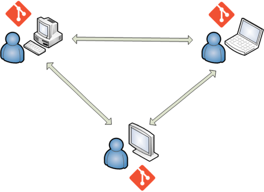

# Gestion des versions

L'objectif de ce chapitre est de découvrir ce qu'est la gestion des versions d'un logiciel, en utilisant comme exemple l'outil Git.


## Introduction

Nous avons déjà mentionné qu'un projet logiciel d'entreprise a une durée de vie de plusieurs années et subit de nombreuses évolutions au cours de cette période. On rencontre souvent le besoin de livrer de nouvelles versions qui corrigent des bogues ou apportent de nouvelles fonctionnalités. Le code source du logiciel "vit" donc plusieurs années. Afin de pouvoir corriger des problèmes signalés par un utilisateur du logiciel, on doit savoir précisément quels fichiers source font partie de quelle(s) version(s).

En entreprise, seuls une petite minorité de logiciels sont conçus par un seul développeur. La grande majorité des projets sont réalisés et/ou maintenus par une équipe de plusieurs personnes travaillant sur la même base de code source. Ce travail en parallèle est source de complexité : 

* Comment récupérer le travail d'un autre membre de l'équipe ? 
* Comment publier ses propres modifications ?
* Comment faire en cas de modifications conflictuelles (travail sur le même fichier source qu'un ou plusieurs collègues) ?
* Comment accéder à une version précédente d'un fichier ou du logiciel entier ?

Pour les raisons précédentes, tout projet logiciel d'entreprise (même mono-déveleppeur) doit faire l'objet d'une **gestion des versions** (*Revision Control System* ou *versioning*). La gestion des versions vise les objectifs suivants :

* Assurer la pérennité du code source d'un logiciel.
* Permettre le travail collaboratif.
* Fournir une gestion de l'historique du logiciel.

> La gestion des versions est parfois appelée gestion du code source (**SCM**, *Source Code Management*).

La gestion des versions la plus basique consiste à déposer le code source sur un répertoire partagé par l'équipe de développement. Si elle permet à tous de récupérer le code, elle n'offre aucune solution aux autres complexités du développement en équipe et n'autorise pas la gestion des versions. 

Afin de libérer l'équipe de développement des complexités du travail collaboratif, il existe une catégories de logiciels spécialisés dans la gestion des versions. 

## Les logiciels de gestion des versions

### Principales fonctionnalités

Un logiciel de gestion des versions est avant tout un **dépôt de code** qui héberge le code source du projet. Chaque développeur peut accéder au dépôt afin de récupérer le code source, puis de publier ses modifications. Les autres développeurs peuvent alors récupérer le travail publié. 

Le logiciel garde la trace des modifications successives d'un fichier. Il permet d'en visualiser l'**historique** et de revenir à une version antérieure.

Un logiciel de gestion des versions permet de travailler en parallèle sur plusieurs problématiques (par exemple, la correction des bogues de la version publiée et l'avancement sur la future version) en créant des **branches**. Les modifications réalisées sur une branche peuvent ensuite être intégrées (*merging*) à une autre.

En cas d'apparition d'un **conflit** (modifications simultanées du même fichier par plusieurs développeurs), le logiciel de gestion des versions permet de comparer les versions du fichier et de choisir les modifications à conserver ou à rejeter pour créer le fichier fusionné final.

Le logiciel de gestion des versions permet de regrouper logiquement des fichiers par le biais du *tagging* : il ajoute aux fichiers source des tags correspondant aux différentes versions du logiciel.

### Gestion centralisée Vs gestion décentralisée

On peut classer les logiciels de gestion des versions en deux catégories.

La première catégorie offre une gestion centralisée du code source. Dans ce cas de figure, il n'existe qu'un seul dépôt qui fait référence. Les développeurs se connectent au logiciel de gestion des versions suivant le principe du **client/serveur**. Cette solution offre les avantages de la centralisation (administration facilitée) mais handicape le travail en mode déconnecté : une connexion au logiciel de SCM est indispensable.


Une seconde catégorie est apparu il y a peu. Elle consiste à voir le logiciel de gestion des versions comme un outil individuel permettant de travailler de manière décentralisé (hors ligne). Dans ce cas de figure, il existe autant de dépôts de code que de développeurs sur le projet. Le logiciel de gestion des versions fournit heureusement un service de synchronisation entre toutes ces bases de code. Cette solution fonctionne suivant le principe du **pair-à-pair**. Cependant, il peut exister un dépôt de référence contenant les versions livrées.


### Principaux logiciels de gestion des versions

Il existe de très nombreux logiciels de gestion des versions ([Wikipedia](http://en.wikipedia.org/wiki/Comparison_of_revision_control_software )). Nous n'allons citer que les principaux. 

Assez ancien mais toujours utilisé, **CVS** (*Concurrent Versioning System*) fonctionne sur un principe centralisé, de même que son successeur **SVN** (*Subversion*). Tous deux sont souvent employés dans le monde du logiciel libre (ce sont eux-mêmes des logiciels libres). 

Les logiciels de SCM décentralisés sont apparus plus récemment. On peut citer **Mercurial** et surtout **Git**, que nous utiliserons dans la suite de ce chapitre. Ce sont également des logiciels libres.

Microsoft fournit un logiciel de SCM développé sur mesure pour son environnement. Il se nomme **TFS** (*Team Foundation Server*) et fonctionne de manière centralisée. TFS esr une solution payante.

> Il est tout à fait possible de gérer le code source d'un projet .NET avec un autre outil de gestion des verions que TFS.

## Présentation de Git

[Git](https://git-scm.com/)  est un [logiciel libre](https://fr.wikipedia.org/wiki/Logiciel_libre) de [gestion des versions](https://fr.wikipedia.org/wiki/Gestion_de_versions). C'est un outil qui permet d'archiver et de maintenir les différentes versions d'un ensemble de fichiers textuels constituant souvent le code source d'un projet logiciel. Créé à l'origine pour gérer le code du noyau Linux, il est multi-langages et multi-plateformes. Git est devenu à l'heure actuelle un quasi-standard.


> Le nom "Git" se prononce comme dans "guitare" et non pas comme dans "jitsu".

### Fonctionnement

Git rassemble dans un **dépôt** (*repository* ou *repo*) l'ensemble des données associées au projet. Il fonctionne de manière [décentralisée](https://fr.wikipedia.org/wiki/Gestion_de_versions#Gestion_de_versions_d.C3.A9centralis.C3.A9e) : tout dépôt Git contient l’intégralité des données (code source, historique, versions, etc). Chaque participant au projet travaille à son rythme sur son dépôt local. Il existe donc autant de dépôts que de participants. Git offre des mécanismes permettant de synchroniser les modifications entre tous les dépôts. 



Un dépôt Git correspond physiquement à un ensemble de fichiers rassemblés dans un répertoire `.git`. Sauf cas particulier, il n'est pas nécessaire d'intervenir manuellement dans ce répertoire.

Lorsqu'on travaille avec Git, il est essentiel de faire la distinction entre trois zones :

* Le **répertoire de travail** (*working directory*) correspond aux fichiers actuellement sauvegardés localement.
* L'**index** ou *staging area* est un espace de transit.
* **HEAD** correspond aux derniers fichiers ajoutés au dépôt.


### Principales opérations

Bien qu'il existe de nombreux plugins et autres interfaces graphiques, Git est à la base prévu pour être utilisé sous forme de commandes textuelles. Les principales commandes sont :

* `git init`: crée un nouveau dépôt vide à l'emplacement courant.
* `git status`: affiche les différences entre le répertoire de travail, l'index et HEAD.
* `git add`: ajoute des fichiers depuis le répertoire de travail vers l'index.
* `git commit`: ajoute des fichiers depuis l'index vers HEAD.
* `git clone`: clone un dépôt existant local ou distant.
* `git pull`: récupère des modifications depuis un dépôt distant vers HEAD.
* `git push`: publie des modifications depuis HEAD vers un dépôt distant.

Pour plus de détails sur les autres opérations possibles, consultez [ce mémento](http://slam5.lmdsio.fr/lessons/memento-git).

### Notion de branche

Une branche permet de travailler de manière isolée sur une problèmatique particulière. Leur gestion par Git est particulièrement simple et efficace.

Tout dépôt Git possède une branche par défaut nommée `master`. On peut ensuite créer de nouvelles branches (`git branch`), y effectuer des modifications, puis fusionner cette branche avec la branche par défaut (`git merge`).


### Le fichier `.gitignore`

Lorsqu'il est présent à la racine d'un répertoire géré par Git, le fichier `.gitignore` permet d'ignorer certains fichiers qui n'ont pas à être versionnés. C'est typiquement le cas des fichiers créés lors de la génération du logiciel ou des composants externes téléchargés par un gestionnaire de dépendances.

La plate-forme GitHub maintient en ligne une [liste de fichiers .gitignore](https://github.com/github/gitignore) pour de nombreux types de projets. Voici un extrait du fichier `.gitignore` pour l'environnement Visual Studio.

```
# User-specific files
*.suo
*.user
*.userosscache
*.sln.docstates

# User-specific files (MonoDevelop/Xamarin Studio)
*.userprefs

# Build results
[Dd]ebug/
[Dd]ebugPublic/
[Rr]elease/
[Rr]eleases/
x64/
x86/
bld/
[Bb]in/
[Oo]bj/
[Ll]og/

# ...
```