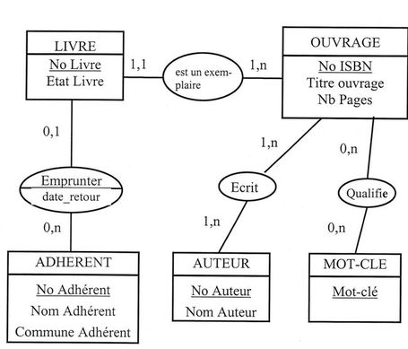
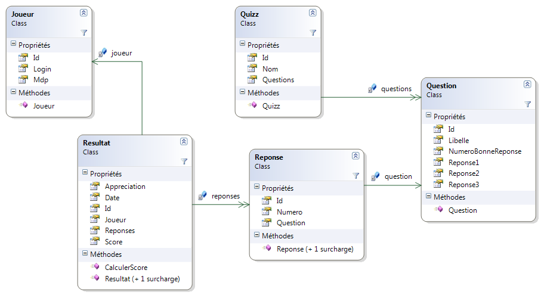
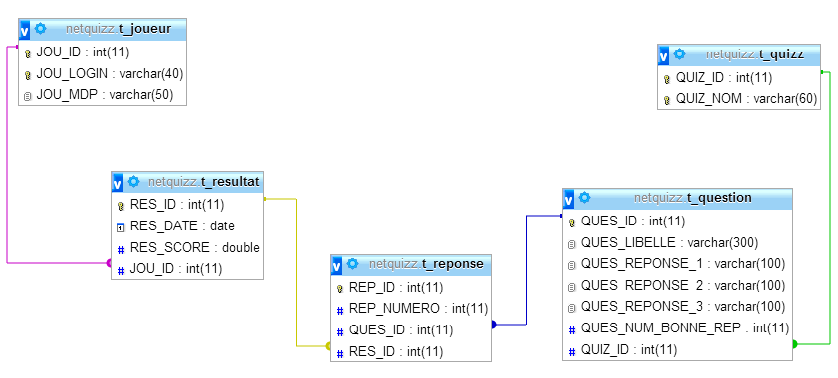
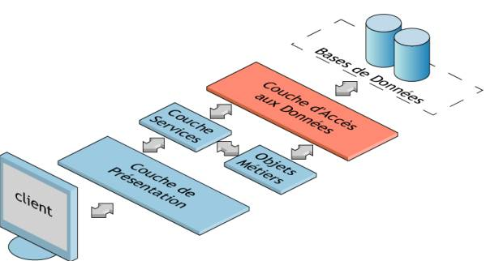
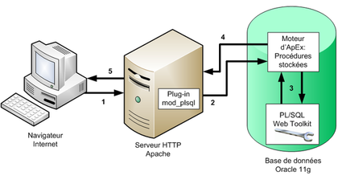
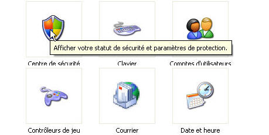

# Documentation

L'objectif de ce chapitre est de découvrir les différents aspects associés à la documentation  d'un logiciel.


# Introduction

Nous avons déjà mentionné à plusieurs reprises qu'un logiciel a une durée de vie de plusieurs années et subit de nombreuses évolutions au cours de cette période. En entreprise, seuls une petite minorité de logiciels sont conçus par un seul développeur. La grande majorité des projets sont réalisés et/ou maintenus par une équipe de plusieurs personnes travaillant sur la même base de code source. Il est fréquent que les effectifs changent et que des développeurs soient amenés à travailler sur un logiciel sans avoir participé à sa création. L'intégration de ces nouveaux développeurs doit être aussi rapide et efficace que possible.

Cependant, il est malaisé, voire parfois très difficile, de se familiariser avec un logiciel par la seule lecture de son code source. En complément, un ou plusieurs documents doivent accompagner le logiciel. On peut classer cette documentation en deux catégories : 

* La documentation technique
* La documentation utilisateur.

# La documentation technique

## Rôle

Le mot-clé de la documentation technique est "comment". Il ne s'agit pas ici de dire pourquoi le logiciel existe, ni de décrire ses fonctionnalités attendues. Ces informations figurent dans d'autres documents comme le cahier des charges. Il ne s'agit pas non plus d'expliquer à un utilisateur du logiciel ce qu'il doit faire pour effectuer telle ou telle tâche : c'est le rôle de la documentation utilisateur.

La documentation technique doit expliquer **comment** fonctionne le logiciel.

## Public visé

La documentation technique est écrite par des informaticiens, pour des informaticiens. Elle nécessite des compétences techniques pour être comprise. Le public visé est celui des personnes qui interviennent sur le logiciel du point de vue technique : développeurs, intégrateurs, responsables techniques, éventuellements chefs de projet.

Dans le cadre d'une relation maîtrise d'ouvrage / maîtrise d'oeuvre pour réaliser un logiciel, la responsabilité de la documentation technique est à la charge de la maîtrise d'oeuvre. Bien sûr, le ou les document(s) associé(s) sont fournis à la MOA en fin de projet.

## Contenu

Le contenu de la documentation technique varie fortement en fonction de la structure et de la complexité du logiciel associé. Néanmoins, nous allons décrire les aspects qu'on y retrouve le plus souvent.

> Les paragraphes ci-dessous ne constituent pas un plan-type de documentation technique.

### Modélisation

La documentation technique inclut les informations liées au domaine du logiciel. Elle précise comment les éléments métier ont été modélisées informatiquement au sein du logiciel.

Si le logiciel a fait l'objet d'une modélisation de type entité-association, la documentation technique présente le modèle conceptuel résultat.



Si le logiciel a fait l'objet d'une modélisation orientée objet, la documentation technique inclut une représentation des principales classes (souvent les classes métier) sous la forme d'un diagramme de classes respectant la norme UML.



Si le logiciel utilise une base de données, la documentation technique doit présenter le modèle d'organisation des données retenu, le plus souvent sous la forme d'un modèle logique sous forme graphique.



### Architecture

La phase d'architecture d'un logiciel permet, en partant des besoins exprimés dans le cahier des charges, de réaliser les grands choix qui structureront le développement : technologies, langages, patrons utilisés, découpage en sous-parties, outils, etc.

La documentation technique doit décrire tous ces choix de conception. L'ajout de schémas est conseillé, par exemple pour illustrer une organisation logique multicouches.



L'implantation physique des différents composants (appelés parfois tiers) sur une ou plusieurs machines doit également être documentée.



### Production du code source

Afin d'augmenter la qualité du code source produit, de nombreux logiciels adoptent des normes ou des standards de production du code source : conventions de nommage, formatage du code, etc. Certains peuvent être internes et spécifiques au logiciel, d'autres sont reprises de normes existantes (exemples : normes PSR-x pour PHP).

Afin que les nouveaux développeurs les connaissent et les respectent, ces normes et standards doivent être présentés dans la documentation technique.

### Génération

Le processus de génération ("build") permet de passer des fichiers sources du logiciel aux éléments exécutables. Elle inclut souvent une phase de compilation du code source.

Sa complexité est liée à celle du logiciel. Dans les cas simples, toute la génération est effectuée de manière transparente par l'IDE utilisé. Dans d'autres, elle se fait en plusieurs étapes et doit donc être documentée.

### Déploiement

La documentation technique doit indiquer comment s'effectue le déploiement du logiciel, c'est-à-dire l'installation de ses différents composants sur la ou les machines nécessaire(s). Là encore, cette étape peut être plus ou moins complexe et nécessiter plus ou moins de documentation.

### Documentation du code source

Il est également possible de documenter un logiciel directement depuis son code source en y ajoutant des commentaires (voir plus haut). Certains langages disposent d'un format spécial de commentaire permettant de créer une documentation auto-générée

Le langage Java a le premier introduit une technique de documentation du code source basée sur l'ajout de commentaires utilisant un format spécial. En exécutant un outil du JDK appelé **javadoc**, on obtient une documentation du code source au format HTML.

Voici un exemple de méthode Java documentée au format javadoc.

```java
/**
 * Valide un mouvement de jeu d'Echecs.
 * 
 * @param leDepuisFile   File de la pièce à déplacer
 * @param leDepuisRangée Rangée de la pièce à déplacer
 * @param leVersFile     File de la case de destination 
 * @param leVersRangée   Rangée de la case de destination 
 * @return vrai si le mouvement d'échec est valide ou faux si invalide
 */
boolean estUnDeplacementValide(int leDepuisFile, int leDepuisRangée, int leVersFile, int leVersRangée)
{
   // ...
}
```

L'avantage de cette approche est qu'elle facilite la documentation du code par les développeurs, au fur et à mesure de son écriture. Depuis, de nombreux langages ont repris l'idée.

Voici un exemple de documentation d'une classe C#, qui utilise une syntaxe légèrement différente.

```csharp
/// <summary>
/// Classe modélisant un adversaire de Chifoumi
/// </summary>
public class Adversaire
{
    /// <summary>
    /// Générateur de nombres aléatoires
    /// Utilisé pour simuler le choix d'un signe : pierre, feuille ou ciseau
    /// </summary>
    private static Random rng = new Random();

    /// <summary>
    /// Fait choisir aléatoirement un coup à l'adversaire
    /// Les coups possibles sont : "pierre", "feuille", "ciseau"
    /// </summary>
    /// <returns>Le coup choisi</returns>
    public string ChoisirCoup()
    {
       // ...
    }
}
```

## La documentation utilisateur

### Rôle

Contrairement à la documentation technique, la documentation d'utilisation ne vise pas à faire comprendre comment le logiciel est conçu. Son objectif est d'apprendre à l'utilisateur à se servir du logiciel.

La documentation d'utilisation doit être : 

* Utile : une information exacte, mais inutile, ne fait que renforcer le sentiment d'inutilité et gêne la recherche de l'information pertinente ;
* Agréable : sa forme doit favoriser la clarté et mettre en avant les préoccupations de l'utilisateur et non pas les caractéristiques techniques du produit.

### Public visé

Le public visé est l'ensemble des utilisateurs du logiciel. Selon le contexte d'utilisation, les utilisateurs du logiciel à documenter peuvent avoir des connaissances en informatique (exemples : cas d'un IDE ou d'un outil de SCM). Cependant, on supposera le plus souvent que le public visé n'est pas un public d'informaticiens.

Conséquence essentielle : toute information trop technique est à bannir de la documentation d'utilisation. Pas question d'aborder l'architecture MVC ou les design patterns employés : ces éléments ont leur place dans la documentation technique.

D'une manière générale, s'adapter aux connaissances du public visé constitue la principale difficulté de la rédaction de la documentation d'utilisation.

### Formes possibles

#### Manuel utilisateur

La forme la plus classique de la documentation d'utilisation consiste à rédiger un manuel utilisateur, le plus souvent sous la forme d'un document bureautique. Ce document est structuré et permet aux utilisateurs de retrouver les informations qu'ils recherchent. Il intègre très souvent des captures d'écran afin d'illustrer le propos.

Un manuel utilisateur peut être organisé de deux façons :

* **Guide d'utilisation** : ce mode d'organisation décompose la documentation en grandes fonctionnalités décrites pas à pas et dans l'ordre de leur utilisation. Exemple pour un logiciel de finances personnelles : création d'un compte, ajout d'écritures, pointage... Cette organisation plaît souvent aux utilisateurs car elle leur permet d'accéder facilement aux informations essentielles. En revanche, s'informer sur une fonctionnalité avancée ou un détail complexe peut s'avérer difficile.

* **Manuel de référence** : dans ce mode d'organisation, on décrit une par une chaque fonctionnalité du logiciel, sans se préoccuper de leur ordre ou de leur fréquence d'utilisation. Par exemple, on décrit l'un après l'autre chacun des boutons d'une barre de boutons, alors que certains sont plus "importants" que d'autres. Cette organisation suit la logique du créateur du logiciel plutôt que celle de son utilisateur. Elle est en général moins appréciée de ces derniers.

#### Tutoriel

De plus en plus souvent, la documentation d'utilisation inclut un ou plusieurs tutoriel(s), destinés à faciliter la prise en main initiale du logiciel. Un tutoriel est un guide pédagogique constitué d'instructions détaillées pas à pas en vue d'objectifs simples.

Le tutoriel a l'avantage de "prendre l'utilisateur par la main" afin de l'aider à réaliser ses premiers pas avec le logiciel qu'il découvre, sans l'obliger à parcourir un manuel utilisateur plus ou moins volumineux. Il peut prendre la forme d'un document texte, ou bien d'une vidéo ou d'un exercice interactif. Cependant, il est illusoire de vouloir documenter l'intégralité d'un logiciel en accumulant les tutoriels.

#### FAQ

Une Foire Aux Questions (en anglais *Frequently Asked questions*) est une liste de questions/réponses sur un sujet. Elle peut faire partie de la documentation d'utilisation d'un logiciel.

La création d'une FAQ permet d'éviter que les mêmes questions soient régulièrement posées.

#### Aide en ligne

L'aide en ligne est une forme de documentation d'utilisation accessible depuis un ordinateur. Il peut s'agir d'une partie de la documentation publiée sur Internet sous un format hypertexte.  

Quand une section de l'aide en ligne est accessible facilement depuis la fonctionnalité d'un logiciel qu'elle concerne, elle est appelée aide contextuelle ou aide en ligne contextuelle. Les principaix formats d'aide en ligne sont le HTML et le PDF. Microsoft a publié plusieurs formats pour l'aide en ligne des logiciels tourant sous Windows : HLP, CHM ou encore MAML.

Un moyen simple et efficace de fournir une aide en ligne consiste à définir des infobulles (*tooltips*). Elles permettent de décrire succinctement une fonctionnalité par survol du curseur.



## Conseils de rédaction

### Structure

Qu'elle soit technique ou d'utilisation, toute documentation doit absolument être écrite de manière **structurée**, afin de faciliter l'accès à une information précise.

Structurer un document bureautique signifie :

* Le décomposer en paragraphes suivant une organisation hiérarchique.
* utiliser des styles de titre, une table des matières, des références...

### Niveau de langage

Comme dit plus haut, le public visé n'a pas forcément d'expérience informatique : il faut bannir les explications trop techniques et penser à définir les principaux termes et le "jargon" utilisé. 

Une documentation doit être rédigée dans une langue simple, pour être compris de tous, y compris de personnes étrangères apprenant la langue.

